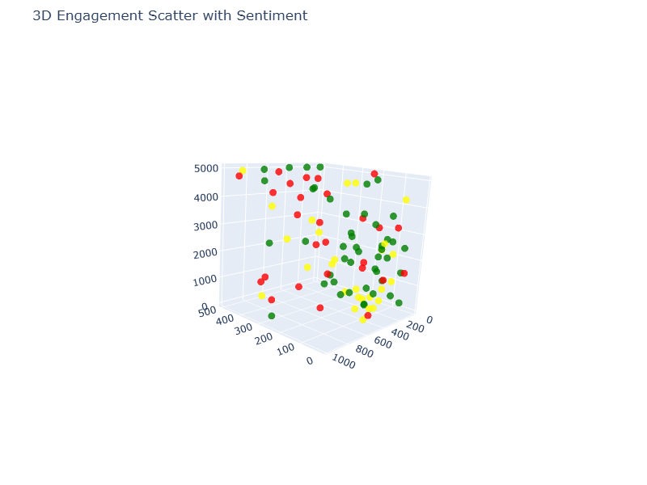

# Social Media Engagement Analysis

## Overview

This project analyzes social media engagement data to understand patterns of user interaction on posts. The dataset includes information on likes, shares, comments, posting time, and sentiment. The goal is to identify the most engaging posts and visualize engagement trends using Python, Pandas, Matplotlib, Seaborn, and Plotly.

---

## Dataset

The dataset contains the following columns:
post_id, platform, post_type, post_time, Likes, Comments, Shares, post_day, sentiment_score, engagement

**Key metrics:**

- Likes, Comments, Shares  
- Engagement (calculated as Likes + Comments + Shares)  
- Sentiment score (Positive, Neutral, Negative)  

---

## Data Cleaning & Exploration

Performed initial exploratory data analysis (EDA) using Pandas:

- `df.head()` – View the first few rows of the dataset  
- `df.describe()` – Summary statistics of numeric columns  
- `df.info()` – Check data types and non-null counts  
- `df.isnull().sum()` – Identify missing values  
- `df.duplicated().sum()` – Check for duplicate rows  
- `df.dropna()` – Remove rows with missing data if necessary  
- `df.columns` – View column names  

---

## Analysis & Visualizations

### 1. Distribution Analysis
Visualized the distribution of Likes, Shares, and Comments using:

- Histograms (`sns.histplot`)  
- Boxplots (`sns.boxplot`)
- 
- 


### 2. Engagement Over Time
- Line plot of total engagement over time to observe trends in post performance.
- 


### 3. Top Posts
- Top 10 most engaging posts identified using total engagement scores.  
- Bar plots created to visualize the highest performing posts.
- 


### 4. Correlation Analysis
- Correlation heatmap between Likes, Comments, Shares, engagement, and sentiment score to understand relationships between metrics.
- 


### 5. 3D Visualizations
**Matplotlib 3D scatter plots:**  
- Engagement across Likes, Comments, and Shares  
- Engagement colored by sentiment (Positive, Neutral, Negative)
- 


**Plotly 3D scatter plot:**  
- Interactive visualization of engagement by Likes, Comments, and Shares  
- Hover to see exact values  
- Sentiment color-coded for better insights
- fig.write_image("images/newplot.png")
- 
---

## Tools & Libraries

- Python  
- Pandas (data manipulation)  
- Matplotlib & Seaborn (static visualizations)  
- Plotly (interactive 3D visualizations)  

---

## Key Insights

- Some posts achieve extremely high engagement, while most posts have moderate interaction.  
- Likes are generally higher than comments and shares.  
- Engagement trends over time show peaks at specific posting dates.  
- Sentiment plays a role in engagement — posts with positive sentiment often show higher interaction.  
- Correlation heatmaps indicate strong relationships between Likes, Shares, Comments, and total engagement.  

---
## How to Run
1. Clone the repository:  
```bash
git clone https://github.com/Suravipoudel1/SoftGrowTech_task2_social_media_engagement_analysis.git
